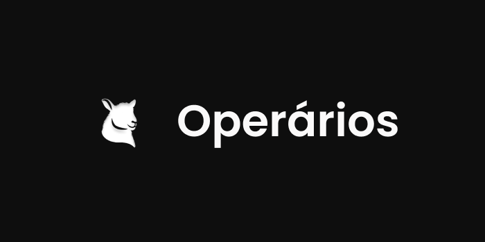
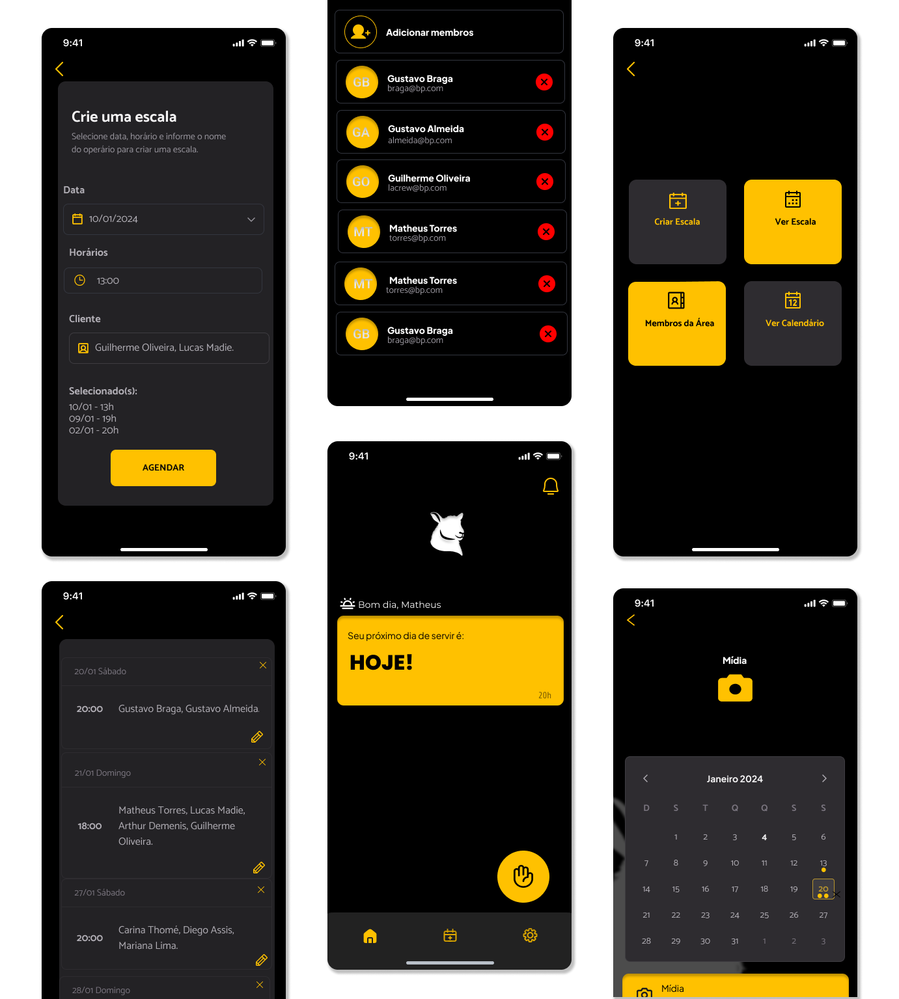

<div align="center">
  
</div>

# Operários API

Repositório do serviço de gerenciamento de escalas do projeto [Operários](https://github.com/gustavobraga1001/operarios-react).

## Implementações Técnicas

- Autenticação e autorização com JWT
- Arquitetura em Camadas
- Migrations de Banco de Dados
- Docker para conteinerização da aplicação
- Configuração de perfis para execução local e em ambiente de produção

## Tecnologias e Ferramentas

A PoC foi desenvolvida utilizando as seguintes tecnologias:

- Linguagem de Programação: Java
- Framework: Spring Boot
- Banco de Dados: PostgreSQL
- Ferramentas: Git, Docker, Flyway

## Pré-Requisitos

Antes de começar, certifique-se de ter os seguintes pré-requisitos instalados em seu ambiente de desenvolvimento:

- **JDK (Java Development Kit)**: É necessário ter o JDK 21 ou superior instalado para compilar e executar o projeto.
- **Docker**: É necessário possuir o docker instalado para executar a aplicação em ambiente local e banco de dados.

### Clone o projeto

```shell
git clone https://github.com/gustxvo/operarios-api.git
```

### Entre no diretório do projeto

```shell
cd operarios-api
```

### Execute o comando

```shell
./gradlew bootRun
```

## 🌐Operários App

O app Operários pode ser acessado através deste [link](https://operarios-react.vercel.app/).



### 🫴Autores

- [Gustavo Braga](https://www.github.com/gustxvo)
- [Matheus Torres](https://www.github.com/gustavobraga1001)
- [Gustavo Almeida Carvalho](https://www.github.com/gustxvo)